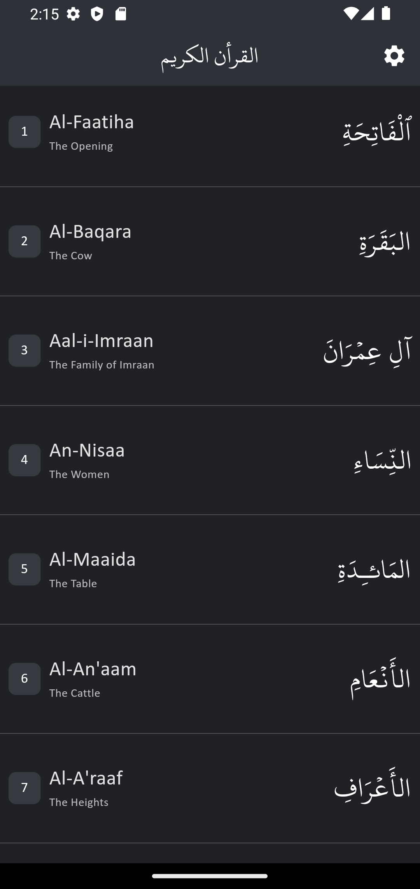
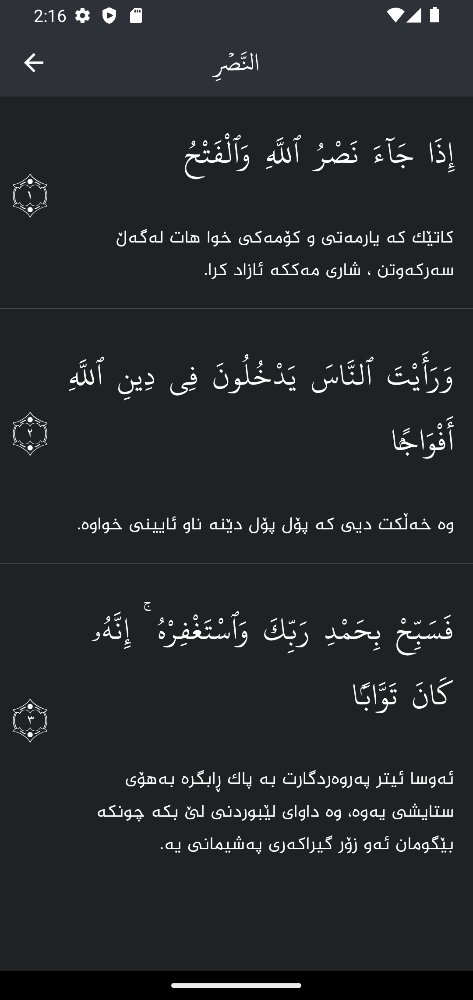
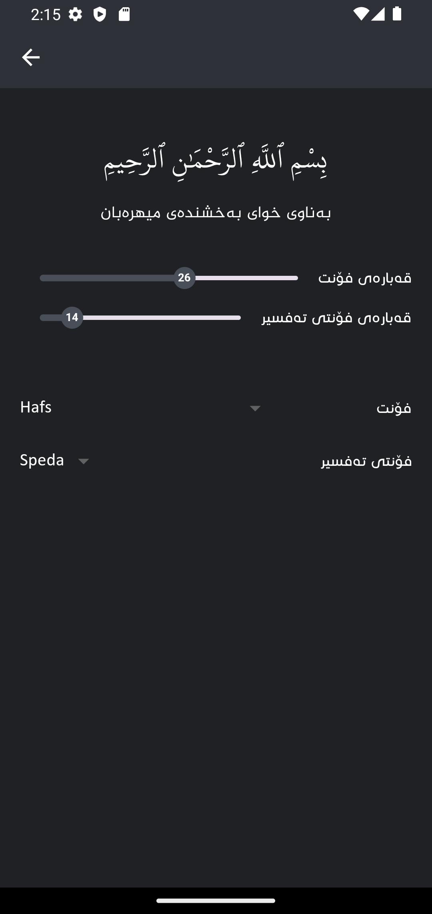

# Quran App (Flutter)

This Quran app, built with Flutter, provides users with a seamless and enriching experience while reading and exploring the Holy Quran. It offers a range of features and functionalities to facilitate easy access, comprehension, and study of the Quran.

<h3>Screenshots:</h3>

  
  
  

